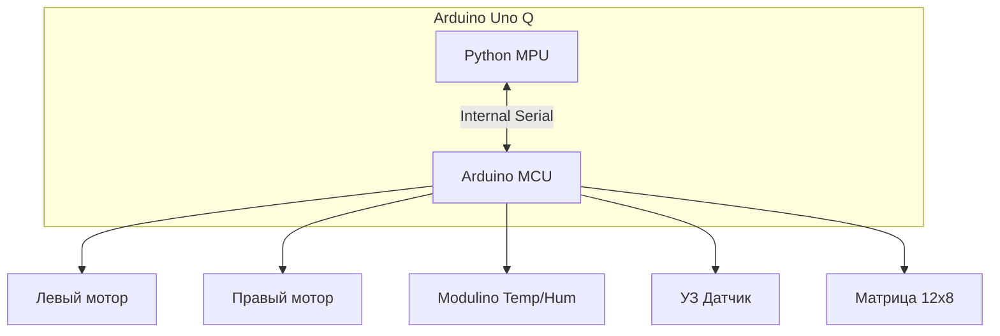

# Как я собрал робота с характером на базе Gemini API и Arduino Uno Q (и научил его подмигивать)

Привет, Хабр!

Вы когда-нибудь мечтали о роботе, который не просто выполняет команды «едь прямо» или «поверни налево», а может обидеться на вас за глупый вопрос или радостно подмигнуть, увидев кота? Я тоже. И решил, что хватит мечтать — пора собирать.

В этой статье я расскажу, как за пару вечеров собрал "гипер-интерактивного" робота, используя **Arduino Uno Q**, немного Python-магии и **Google Gemini Robotics API**. У него нет рук, нет ног, но есть колеса, матричное лицо и, самое главное, — характер.

<cut/>

## Идея: "Мозг" и "Мышцы"

Главная проблема DIY-роботов — вычислительная мощность. Обычно приходится выбирать между Arduino (хорошо крутит моторами) и Raspberry Pi (умеет думать). Но **Arduino Uno Q** меняет правила игры. Она объединяет в себе и то, и другое:

1.  **MPU (Main Processing Unit)**: Мощный "мозг" на Python, который видит, слышит и общается с LLM (Large Language Model).
2.  **MCU (Microcontroller Unit)**: "Мышцы" (C++), которые дергают сервоприводами, светят светодиодами и следят за датчиками.

## Железо: Из чего же сделаны наши мальчишки?

Сборка получилась максимально доступной, но с парой интересных апгрейдов:

-   **Arduino Uno Q**: Звезда шоу. Встроенная LED-матрица 12x8 — это киллер-фича для создания "лица" робота.
-   **Modulino Thermo**: Сенсор температуры и влажности (потому что робот должен знать, когда ему жарко).
-   **Шасси**: Классическая двухколесная платформа (differential drive).
-   **Сервоприводы**: 2 штуки постоянного вращения (Continuous Rotation) для колес.
-   **Сенсоры**: Ультразвуковой датчик расстояния (NewPing) — глаза робота "на ощупь".
-   **Периферия**: USB-вебкамера, микрофон и динамик (подключены к USB MPU).

Схема подключения теперь включает Modulino:



## 3D-печать: Сам себе инженер

Вся механика робота распечатана на 3D-принтере. Я использовал OpenSCAD для создания параметрических моделей — это позволяет легко менять размеры колес или шасси, просто поменяв пару переменных в коде. Модели (`.scad` и `.stl`) лежат в папке `3d`.

## Софт: Эволюция до AGI

Самое вкусное — это софт. Архитектура проекта немного усложнилась и разделилась на сервисы для большей гибкости.

### 1. Arduino (C++) — "Мышцы и Рефлексы"

Микроконтроллер теперь не просто "дёргает ногами", а слушает команды высокого уровня через `agi_loop`.

Основные функции скетча:
-   **Сбор телеметрии**: Читает дистанцию с сонара, температуру/влажность с Modulino и отправляет это в Arduino Cloud/MPU.
-   **Исполнительный механизм**: Парсит строковые команды вида `MOVE|forward|20|45` (ехать вперед 20см со скоростью 45) или `TURN|left|60|45` (поворот на 60 градусов).
-   **Safety**: Если датчик расстояния видит препятствие в упор, робот меняет дистанцию на "бесконечность" (чтобы не паниковать) или останавливается — простейший рефлекс.

### 2. Python (MPU) — "Дирижер" (`main.py`)

Этот скрипт связывает облако Arduino, низкоуровневые команды и "высший разум".
Он запускает непрерывный цикл (на стороне Arduino вызывается как `agi_loop`), который:
1.  Получает текущую дистанцию.
2.  Отправляет запрос в **Media Service**.
3.  Получает JSON с планом действий.
4.  Транслирует план в простые команды для Arduino (`MOVE`, `TURN`).

### 3. Media Service & LLM — "Высший Разум" (`media_service.py`)

Вся "тяжелая" логика вынесена в отдельный HTTP микросервис. Это позволяет не блокировать основной поток управления.
Здесь живет `Gemini Robotics ER 1.5 Preview`.

**System Prompt** стал намного серьезнее. Теперь мы учим робота не только болтать, но и планировать (Reasoning):

```python
schema_instructions = (
    "You are a smart robot assistant with two wheels and NO arms or head. "
    "Your inputs are: 1. Current image from webcam. 2. Ultrasonic distance reading. 3. Your goal. 4. Movement history. "
    "BEHAVIOR RULES:\n"
    "1. SAFETY FIRST: If 'distance' < 25 cm, you ARE BLOCKED. Mod Back or Turn.\n"
    "2. MEMORY: Use 'movement_history' and 'subplan' to avoid loops.\n"
    "3. REASONING: Explain strategy in 'subplan'."
)
```

**JSON Schema** ответа теперь включает "внутренний монолог" (`subplan`) для памяти:

```json
{
    "speak": { "text": "Вижу елку, двигаюсь к ней." },
    "move": { 
        "command": "forward", 
        "distance_cm": 50, 
        "angle_deg": 0 
    },
    "subplan": "Target visible at center. Closing distance. Scanned left side previously."
}
```

## Как это работает в жизни

1.  **Vision Loop**: Кадр с веб-камеры улетает в модель вместе с историей последних движений.
2.  **Reasoning**: Gemini анализирует картинку: "Ага, передо мной стена, а цель (Найти елку) еще не выполнена. Слева свободно".
3.  **Action**: Генерирует JSON: `move: { command: "left", angle_deg: 45 }`, `subplan: "Turning left to avoid wall and scan new area"`.
4.  **Execution**: `main.py` превращает это в `TURN|left|45|45` и шлет в Arduino.
5.  **Feedback**: Arduino поворачивает сервы, и цикл повторяется.

Такой подход с `subplan` и `movement_history` позволяет роботу не застревать в углах и вести себя более осмысленно, чем простой реактивный бот.

### Пример диалога (логи):

```text
DEBUG: robot.main: AGI loop called with distance: 154, current subplan: Scanning room...
INFO: SoundService: Sending text+image to Gemini Robotics model...
INFO: robot.main: Speak service called: Speaking: Вижу что-то зеленое.
INFO: robot.main: AGI cmd: MOVE|forward|30|45
```

## Грабли, на которые я наступил

1.  **Питание сервоприводов**: Никогда, слышите, НИКОГДА не питайте моторы от 5V пина Arduino. Я поплатился часами отладки "почему оно перезагружается при повороте". Только внешнее питание!
2.  **JSON Hallucinations**: Иногда LLM забывает закрыть скобку или добавляет лишний текст. Пришлось добавить `try-except` и очистку от markdown-тегов.
3.  **Задержки**: Обработка картинки и запрос к API занимают время (1-2 секунды). Для real-time гонок не пойдет, но для вдумчивого собеседника — вполне.

## Итоги

Проект получился живым. Это не просто машинка на радиоуправлении, это сущность, которая _понимает_, что происходит вокруг. Добавление эмоций через LED-матрицу и глаза кардинально меняет восприятие устройства. Оно кажется... живым?

**Что дальше?**

-   Добавление манипулятора (руки!), чтобы он мог не только смотреть, но и трогать.
-   SLAM навигация.

Код проекта открыт (ну, лежит у меня в папке), так что дерзайте! Роботы — это весело. Особенно когда они умеют злиться.

---

_P.S. Если робот начнет просить коды запуска ядерных ракет, я его отключу. Обещаю._
