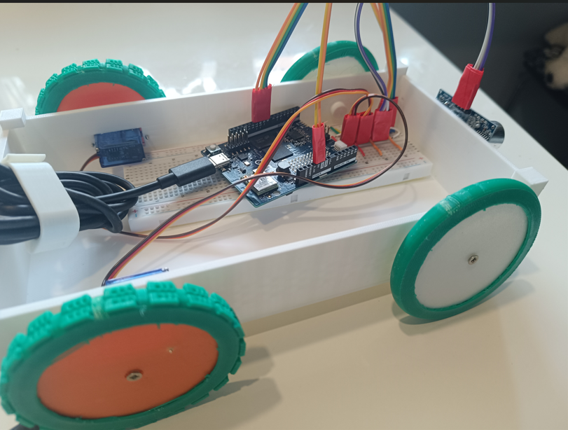
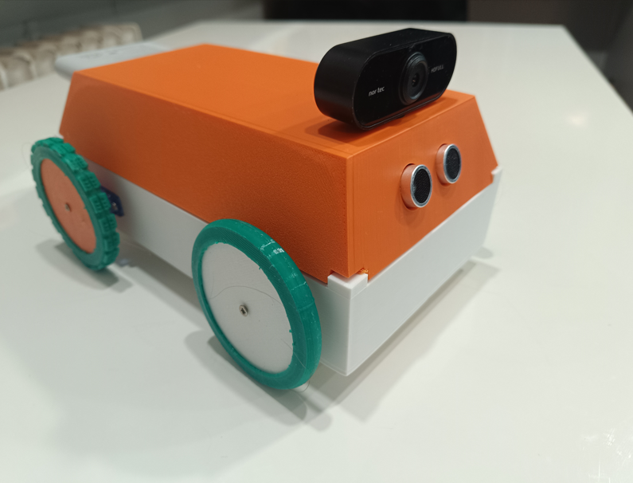
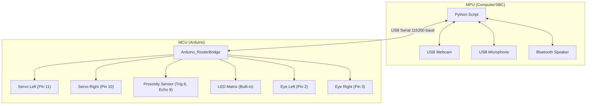

# AGI Robot

This project aims to create a highly interactive, autonomous robot utilizing the Google Gemini Robotics ER 1.5 Preview API for decision-making and real-time interaction.

## Current Prototype Specifications

-   **Core Hardware:** Arduino Uno Q (Microcontroller/Motor Control)
-   **Movement:** Two wheels with 360-degree movement capability (differential drive) - **Pins 11 (Left) & 10 (Right)**
-   **Peripherals:** USB-C dongle (USB Camera, Bluetooth Speaker, Microphone)
-   **Sensors:** Proximity/Distance Sensor (Trig Pin 8, Echo Pin 9)
-   **Power:** PowerBank 20000 mAh
-   **Software Stack:** Python 3.12, Google Gemini Robotics ER 1.5 Preview API
-   **Connectivity:** WiFi required for API access

**Functionality:** Uses wheels for movement, microphone for audio input, speaker for audio output, and camera for visual input. Capable of making autonomous decisions driven by the AI model.

---

## Design Ideas and Future Considerations

### 1. Hardware Enhancements and Modularity

| Area                   | Current Status        | Proposed Enhancement                                                             | Rationale                                                                                                 |
| :--------------------- | :-------------------- | :------------------------------------------------------------------------------- | :-------------------------------------------------------------------------------------------------------- |
| **Microcontroller**    | Arduino Uno Q         | Transition to Raspberry Pi (e.g., Pi 5 or Zero 2 W) or equivalent SBC            | Offload Python processing, improve camera/audio stream handling, and provide local processing capability. |
| **Motor Control**      | Integrated with Uno Q | Dedicated Motor Driver Shield (e.g., L298N or specialized drivers)               | Better current handling, precision control, and separation of logic/power circuits.                       |
| **Sensing/Navigation** | USB Camera only       | Integrate IMU (Accelerometer/Gyroscope) and Proximity Sensors (Ultrasonic/LiDAR) | Enable robust spatial awareness, obstacle avoidance, and precise movement/pose tracking.                  |
| **Physical Structure** | N/A (Assumed generic) | Custom 3D Printed Chassis                                                        | Modular housing for components, better stability, and improved aesthetics for component housing.          |
| **Power Management**   | Single PowerBank      | Integrated Power Distribution Board (PDB) with voltage regulation                | Ensure stable power for SBC, motors, and peripherals; implement low-power warning system.                 |

### 2. Software Architecture and Code Structure

The project currently uses foundational C code (`music.c`, `starwars.c`, `temp.c`) for low-level tasks, while `main.py` handles high-level logic and API interaction.

-   **Refactor C Code:** Consolidate low-level hardware interaction (motor control, sensor reading) into a dedicated library (e.g., `hardware_interface.c`) callable by Python via `ctypes` or similar bindings.
-   **Python Logic (`main.py`):**
    -   Implement a clear state machine for autonomous behavior (e.g., Idle, Exploring, Interacting, Charging).
    -   Separate API communication handling (API client) from local decision-making (Behavior Tree).
-   **Configuration Management:** Introduce a `config.json` or environment variables for API keys, WiFi settings, and hardware calibration values.

### 3. Interaction and Autonomy Features

-   **Actuation:** Introduce one manipulator arm (e.g., 2-3 DOF) for basic physical object interaction, manipulation, and demonstration.
-   **Multi-Modal Interaction:** Beyond simple command/response, implement context memory for longer, more meaningful conversations that persist across interactions.
-   **Environmental Mapping:** Integrate Simultaneous Localization and Mapping (SLAM) capabilities (if transitioning to an SBC) to allow the robot to navigate and remember its environment structure.
-   **Task Execution:** Design a robust system for handling complex, multi-step instructions (e.g., "Go to the kitchen and report if the coffee machine is on").

### 4. Project Development Setup

-   **Dependency Management:** Utilize a `requirements.txt` file for explicit Python dependency tracking.
-   **Development Environment:** Expand the `.vscode/settings.json` to include linting (e.g., Black, Pylint) and debugging configurations for easier collaboration and development setup.

# Robot Hardware Schema

## Overview

The robot consists of an MCU (Arduino) handling motor control and an MPU (PC/SBC) handling high-level logic, vision, and audio. They are connected via USB (Serial).

## Connection Diagram

## Pinout Configuration

| Component       | Arduino Pin | Description                       |
| :-------------- | :---------- | :-------------------------------- |
| **Servo Left**  | D11         | Left Wheel (Continuous Rotation)  |
| **Servo Right** | D10         | Right Wheel (Continuous Rotation) |
| **Sensor**      | D8, D9      | Proximity/Distance (Trig/Echo)    |
| **Eye Left**    | D2          | Left Eye LED                      |
| **Eye Right**   | D3          | Right Eye LED                     |
| **Matrix**      | Built-in    | 12x8 LED Matrix for Emotions      |
| **USB**         | USB Port    | Serial Communication with MPU     |

## Arduino Cloud Variables

The following variables are synchronized with the Arduino Cloud:

-   **Read/Write (Controls):**

    -   `speed` (int): Controls the speed of the robot.
    -   `back` (bool): Command to move backward.
    -   `left` (bool): Command to turn left.
    -   `right` (bool): Command to turn right.
    -   `forward` (bool): Command to move forward.

-   **Read-Only (Telemetry):**
    -   `distance` (int): Distance measured by the ultrasonic sensor (cm).
    -   `temperature` (float): Temperature from Modulino sensor.
    -   `humidity` (float): Humidity from Modulino sensor.

## Power Distribution

-   **Arduino**: Powered via USB or external 7-12V DC jack.
-   **Servos**: **CRITICAL**: Do NOT power servos directly from the Arduino 5V pin. Use an external 5V power supply (e.g., 4xAA battery pack or 5V/2A adapter) for the servos. Connect the external power ground to Arduino GND.

## MPU Requirements

-   **OS**: Linux Debian 13
-   **Python**: 3.13
-   **Ports**: 1x USB-C host for Arduino, 1x USB-A for Webcam with mic.

# TODO

-   [x] use only two motors (servos), reverse one for turning left right
-   [x] get pic from USB and send it to LLM model
-   [x] in prompt ask for json output with fixed schema, allowing speaking and moving (we have no head or arms)
-   [x] speak loudly if returned by model
-   [x] listen to mic and send transcription to LLM model with USB cam picture and proximity sensor data
-   [x] show robot current emotion on integrated LED matrix
-   [x] add two red LEDs (eyes)
