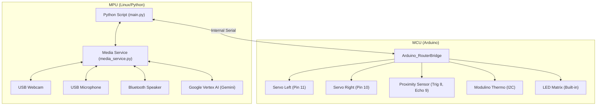
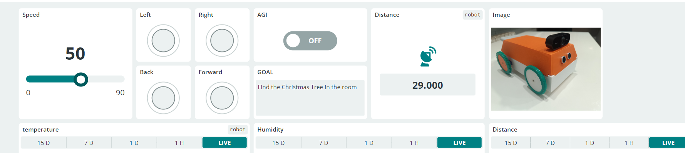

# AGI Robot

This project aims to create a highly interactive, autonomous robot utilizing **Google Cloud Vertex AI (Gemini 2.5 Flash)** for decision-making and real-time interaction.

## Current Prototype Specifications

-   **Core Hardware:** Arduino Uno Q (Microcontroller/Motor Control)
-   **Movement:** Two wheels with 360-degree movement capability (differential drive) - **Pins 11 (Left) & 10 (Right)**
-   **Peripherals:** USB-C dongle (USB Camera with Mic, Bluetooth Speaker)
-   **Sensors:**
    -   Proximity/Distance Sensor (Trig Pin 8, Echo Pin 9)
    -   **Modulino Thermo** (Temperature & Humidity) - Connected via I2C/Qwiic
-   **Power:** PowerBank 10000 mAh
-   **Software Stack:** Python 3.12+, Google Cloud Vertex AI (Gemini 2.5 Flash)
-   **Connectivity:** WiFi required for API access

**Functionality:** Uses wheels for movement, microphone for audio input, speaker for audio output, and camera for visual input. Capable of making autonomous decisions driven by the AI model.

---

## Design Ideas and Future Considerations

### 1. Hardware Enhancements and Modularity

| Area                   | Current Status                           | Proposed Enhancement                                               | Rationale                                                                                        |
| :--------------------- | :--------------------------------------- | :----------------------------------------------------------------- | :----------------------------------------------------------------------------------------------- |
| **Microcontroller**    | Arduino Uno Q                            |                                                                    |                                                                                                  |
| **Motor Control**      | Integrated with Uno Q                    | Dedicated Motor Driver Shield (e.g., L298N or specialized drivers) | Better current handling, precision control, and separation of logic/power circuits.              |
| **Sensing/Navigation** | USB Camera + Proximity + Modulino Thermo | Integrate IMU (Accelerometer/Gyroscope)                            | Enable robust spatial awareness, obstacle avoidance, and precise movement/pose tracking.         |
| **Physical Structure** | Custom 3D Printed Chassis                |                                                                    | Modular housing for components, better stability, and improved aesthetics for component housing. |
| **Power Management**   | Single PowerBank                         |                                                                    | Ensure stable power for SBC, motors, and peripherals; implement low-power warning system.        |

### 2. Software Architecture and Code Structure

-   **Python Logic (`main.py`):**
    -   **AGI Loop**: Implements an autonomous loop (`agi_loop`) where the robot captures an image, checks distance, and consults the Gemini 2.5 Flash model via `media_service.py` to decide on actions (Speak, Move, or update Subplan).
    -   **Object Detection**: Uses `VideoObjectDetection` to identify objects in real-time and announce them (`send_detections_to_ui`).
    -   **Arduino Cloud**: Synchronizes state variables (`speed`, `agi`, etc.) and telemetry (`distance`, `temperature`, `humidity`).
-   **Media Service (`media_service.py`):**
    -   Acts as a local HTTP server handling Text-to-Speech (Google TTS), audio playback (`aplay`), and LLM Vision requests (`/llm_vision` -> Vertex AI).

### 3. Interaction and Autonomy Features

-   **Actuation:** Introduce one manipulator arm (e.g., 2-3 DOF) for basic physical object interaction, manipulation, and demonstration.
-   **Multi-Modal Interaction:** Beyond simple command/response, implement context memory for longer, more meaningful conversations that persist across interactions.
-   **Environmental Mapping:** Integrate Simultaneous Localization and Mapping (SLAM) capabilities to allow the robot to navigate and remember its environment structure.
-   **Task Execution:** Design a robust system for handling complex, multi-step instructions (e.g., "Go to the kitchen and report if the coffee machine is on").

# Robot Hardware Schema

## Overview

The Uno Q consists of an MCU handling motor control and an MPU (Linux Environment) handling high-level logic, vision, and audio.

## Connection Diagram

## Pinout Configuration

| Component       | Arduino Pin | Description                       |
| :-------------- | :---------- | :-------------------------------- |
| **Servo Left**  | D11         | Left Wheel (Continuous Rotation)  |
| **Servo Right** | D10         | Right Wheel (Continuous Rotation) |
| **Sensor**      | D8, D9      | Proximity/Distance (Trig/Echo)    |
| **Modulino**    | I2C         | Temperature & Humidity Sensor     |
| **Matrix**      | Built-in    | 12x8 LED Matrix                   |
| **RGB LED**     | D6, D5, D3  | Red, Green, Blue (Common Cathode) |
| **USB**         | USB Port    | Serial Communication/Webcam       |

## Arduino Cloud Variables

The following variables are synchronized with the Arduino Cloud:

-   **Read/Write (Controls):**

    -   `agi` (bool): Master switch to enable/disable the autonomous AGI loop.
    -   `goal` (str): Current goal for the robot.
    -   `speed` (int): Controls the speed of the robot.
    -   `back` (bool): Command to move backward.
    -   `left` (bool): Command to turn left.
    -   `right` (bool): Command to turn right.
    -   `forward` (bool): Command to move forward.
    -   `rgb` (str): RGB color code (format "R,G,B") for the roof LED.
    -   `lang` (str): Language code (en, ru, cz).

-   **Read-Only (Telemetry):**
    -   `distance` (int): Distance measured by the ultrasonic sensor (cm).
    -   `temperature` (float): Temperature from Modulino sensor (Celsius).
    -   `humidity` (float): Humidity from Modulino sensor (%).

## Power Distribution

-   **Arduino**: Powered via USB PowerBank

## MPU Requirements

-   **OS**: Linux Debian 13
-   **Python**: 3.12+
-   **Ports**: 1x USB-C host for Arduino, 1x USB-A for Webcam with mic.

# TODO

-   [x] listen to mic and send transcription to LLM model 
-   [x] RGB LED on roof with MCU control, to have light in dark room and just for fun
