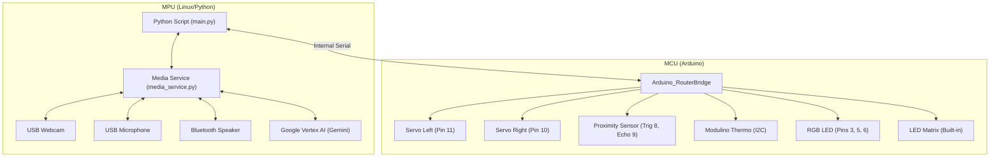

# AGI Robot

This project creates a **fully autonomous, LLM-powered mobile robot** that uses **Google Gemini 2.5 Flash** for real-time decision-making, navigation, and human interaction. The robot combines computer vision, distance sensing, and multi-modal AI to explore environments, accomplish goals, and engage in natural conversations.


## Key Features

- 🤖 **Autonomous Navigation**: LLM-driven pathfinding with obstacle avoidance and spatial mapping
- 👁️ **Computer Vision**: Real-time image analysis for object detection and scene understanding
- 🎤 **Voice Interaction**: Records user responses after speaking, sends audio to LLM for context-aware replies
- 🗣️ **Multi-language TTS**: Supports English, Russian, and Czech with Google WaveNet voices
- 🌈 **Emotional Expression**: RGB LED "mood" changes based on robot's state (thinking, happy, cautious, etc.)
- 📊 **Cloud Integration**: Arduino Cloud for remote monitoring and control
- 🧠 **Memory & Planning**: Maintains movement history, spatial maps, and hierarchical plans to avoid loops
- 🎵 **Sound Effects**: Plays contextual sounds to attract attention or express personality

## Current Prototype Specifications

-   **Core Hardware:** Arduino Uno Q (Microcontroller/Motor Control)
-   **Physical Dimensions:** 24cm wide, 12cm long, **10cm high**
-   **Movement:** Two wheels with 360-degree movement capability (differential drive) - **Pins 11 (Left) & 10 (Right)**. Note: Robot can move **ONLY on the floor**.
-   **Peripherals:** USB-C dongle (USB Camera with Mic, Bluetooth Speaker)
-   **Sensors:**
    -   Proximity/Distance Sensor (Trig Pin 8, Echo Pin 9)
    -   **Modulino Thermo** (Temperature & Humidity) - Connected via I2C/Qwiic
    -   RGB LED (Pins 3, 5, 6) for mood expression
-   **Power:** PowerBank 10000 mAh
-   **Software Stack:** Python 3.12+, Google Cloud Vertex AI (Gemini 2.5 Flash), Arduino Cloud
-   **Connectivity:** WiFi required for API access

**Functionality:** The robot operates autonomously using an AGI loop: captures images, measures distance, consults the LLM, speaks responses, records user audio, and executes movement commands. All decisions are made by the AI model based on visual input, sensor data, goals, and conversation context.

---

## Design Ideas and Future Considerations

### 1. Hardware Enhancements and Modularity

| Area                   | Current Status                           | Proposed Enhancement                                               | Rationale                                                                                        |
| :--------------------- | :--------------------------------------- | :----------------------------------------------------------------- | :----------------------------------------------------------------------------------------------- |
| **Microcontroller**    | Arduino Uno Q                            |                                                                    |                                                                                                  |
| **Motor Control**      | Integrated with Uno Q                    | Dedicated Motor Driver Shield (e.g., L298N or specialized drivers) | Better current handling, precision control, and separation of logic/power circuits.              |
| **Sensing/Navigation** | USB Camera + Proximity + Modulino Thermo | Integrate IMU (Accelerometer/Gyroscope)                            | Enable robust spatial awareness, obstacle avoidance, and precise movement/pose tracking.         |
| **Physical Structure** | Custom 3D Printed Chassis                |                                                                    | Modular housing for components, better stability, and improved aesthetics for component housing. |
| **Power Management**   | Single PowerBank                         |                                                                    | Ensure stable power for SBC, motors, and peripherals; implement low-power warning system.        |


### 2. Software Architecture and Code Structure

-   **Python Logic (`main.py`):**
    -   **AGI Loop**: Implements an autonomous loop (`agi_loop`) where the robot captures an image, checks distance, records audio responses, and consults the Gemini 2.5 Flash model via `media_service.py` to decide on actions.
    -   **Audio Recording**: After the robot speaks, it records 10 seconds of audio from the microphone to capture user responses, saved as `mic.wav` with proper WAV headers.
    -   **Object Detection**: Uses `VideoObjectDetection` to identify objects in real-time and announce them (`send_detections_to_ui`).
    -   **Arduino Cloud**: Synchronizes state variables (`speed`, `agi`, `goal`, `lang`, `rgb`) and telemetry (`distance`, `temperature`, `humidity`).
    -   **RGB Mood**: Converts HSV color values from Arduino Cloud to RGB for the robot's "mood" LED.
    -   **Movement History**: Tracks all movement commands to prevent loops and aid navigation.
    
-   **Media Service (`media_service.py`):**
    -   **HTTP Server** (Port 5000) with the following endpoints:
        -   **GET `/play`**: Plays audio files via `aplay` (parameter: `filename`)
        -   **GET `/play_random`**: Plays a random sound from the `sounds` directory
        -   **GET `/speak`**: Text-to-Speech using Google Cloud TTS with WaveNet voices (parameters: `text`, `lang`)
            - Supports multiple languages: English (`en-US-Neural2-D`), Russian (`ru-RU-Wavenet-D`), Czech (`cs-CZ-Wavenet-A`)
            - Implements caching to avoid re-synthesizing the same text
        -   **POST `/llm_vision`**: Sends image, distance, plan, subplan, map, movement history, **and audio** to Gemini 2.5 Flash (currently using `gemini-3-flash-preview` model)
            - Returns JSON with: `speak`, `sound`, `move`, `rgb`, `plan`, `subplan`, `map`
            - Receives images via Socket.IO from the webcam service
            - Includes sophisticated prompt engineering for robot behavior and safety rules

-   **Arduino MCU (`sketch.ino`):**
    -   **Libraries Used**: `Arduino_RouterBridge`, `Arduino_LED_Matrix`, `Modulino`, `Servo`, `NewPing`
    -   **Main Loop Operations**:
        1. Retrieves cloud variables (`speed`, `back`, `left`, `right`, `forward`, `agi`, `rgb`) via Bridge
        2. Reads ultrasonic distance sensor (NewPing library)
        3. Reads temperature and humidity from Modulino Thermo (I2C)
        4. Updates Arduino Cloud telemetry variables
        5. Executes movement commands (manual or AGI-driven)
    -   **Manual Control**: Individual direction booleans (`back`, `left`, `right`, `forward`) with configurable speed
    -   **AGI Mode**: Calls `agi_loop()` bridge function, parses returned command string (MOVE/TURN/STOP), executes movement with calibrated timing
    -   **RGB Parsing**: Converts "R,G,B" string to individual values, applies color correction for LED hardware characteristics
    -   **LED Matrix**: Available for future visual feedback (currently unused)

### 3. Interaction and Autonomy Features

-   **Actuation:** Introduce one manipulator arm (e.g., 2-3 DOF) for basic physical object interaction, manipulation, and demonstration.
-   **Multi-Modal Interaction:** Beyond simple command/response, implement context memory for longer, more meaningful conversations that persist across interactions.
-   **Environmental Mapping:** Integrate Simultaneous Localization and Mapping (SLAM) capabilities to allow the robot to navigate and remember its environment structure.
-   **Task Execution:** Design a robust system for handling complex, multi-step instructions (e.g., "Go to the kitchen and report if the coffee machine is on").

# Robot Hardware Schema

## Overview

The Uno Q consists of an MCU handling motor control and an MPU (Linux Environment) handling high-level logic, vision, and audio.

## Connection Diagram



## Pinout Configuration

| Component       | Arduino Pin | Description                       |
| :-------------- | :---------- | :-------------------------------- |
| **Servo Left**  | D11         | Left Wheel (Continuous Rotation)  |
| **Servo Right** | D10         | Right Wheel (Continuous Rotation) |
| **Sensor**      | D8, D9      | Proximity/Distance (Trig/Echo)    |
| **Modulino**    | I2C         | Temperature & Humidity Sensor     |
| **Matrix**      | Built-in    | 12x8 LED Matrix                   |
| **RGB LED**     | D6, D5, D3  | Red, Green, Blue (Common Cathode) |
| **USB**         | USB Port    | Serial Communication/Webcam       |

## Arduino Cloud Variables

The following variables are synchronized with the Arduino Cloud:

-   **Read/Write (Controls):**

    -   `agi` (bool): Master switch to enable/disable the autonomous AGI loop.
    -   `goal` (str): Current main goal for the robot (retrieved from cloud).
    -   `speed` (int): Controls the speed of the robot (0-90, where 45 is baseline).
    -   `back` (bool): Command to move backward.
    -   `left` (bool): Command to turn left.
    -   `right` (bool): Command to turn right.
    -   `forward` (bool): Command to move forward.
    -   `rgb` (CloudColoredLight): RGB LED control with HSV values:
        -   `rgb:hue` (0-360): Hue value
        -   `rgb:sat` (0-100): Saturation percentage
        -   `rgb:bri` (0-100): Brightness percentage
        -   `rgb:swi` (bool): Switch on/off
        -   The Python code converts HSV to RGB string format (e.g., "255,128,0") and sends to MCU
    -   `lang` (str): Language code for TTS (en, ru, cz).

-   **Read-Only (Telemetry):**
    -   `distance` (int): Distance measured by the ultrasonic sensor (cm).
    -   `temperature` (float): Temperature from Modulino sensor (Celsius).
    -   `humidity` (float): Humidity from Modulino sensor (%).


## Power Distribution

-   **Arduino**: Powered via USB PowerBank


## MPU Requirements

-   **OS**: Linux Debian 13
-   **Python**: 3.12+
-   **Ports**: 1x USB-C host for Arduino, 1x USB-A for Webcam with mic.
-   **Dependencies**: 
    -   `arduino-app-utils` (Arduino Cloud SDK)
    -   `google-genai` (Gemini API)
    -   `google-api-python-client` (Google TTS)
    -   `python-socketio[client]` (Image streaming)
    -   `aplay` (Audio playback utility)

---

## Configuration

### Environment Variables

The system requires the following environment variables:

-   **`GOOGLE_APPLICATION_CREDENTIALS`**: Path to Google Cloud service account JSON file
    - Linux: `/home/arduino/google.json`
    - Windows: `C:\My-progs\Python\agi-robot\google.json`
-   **`GEMINI_KEY`**: Google Gemini API key for LLM access
-   **`IMAGE_SERVER_URL`** (optional): Socket.IO server URL for webcam feed (default: `http://localhost:4912`)

### File Structure

```
agi-robot/
├── python/
│   ├── main.py              # Main robot control logic
│   ├── media_service.py     # HTTP server for TTS, LLM, and audio
│   └── sounds/              # Directory for random sound effects (.wav files)
├── sketch/
│   └── sketch.ino           # Arduino MCU firmware
└── google.json              # Google Cloud credentials
```

### Startup Behavior

On initialization, the robot:
1. Connects to Arduino Cloud and synchronizes variables
2. Initializes the webcam object detection stream
3. Plays a startup sound (`/home/arduino/1.wav` on Linux)
4. Speaks "Robot is ready" in the configured language
5. Sets default goal: **"Be helpful assistant to the master human"**
6. Begins listening for cloud variable changes (AGI mode, manual controls, goal updates)

### Default Main Goal

The robot's default goal is **"Be helpful assistant to the master human"**, but this can be changed via the Arduino Cloud `goal` variable. When a new goal is set from the cloud, the robot will speak the new goal and update its behavior accordingly.

---

## AGI Loop Behavior

The AGI Loop is the core autonomous decision-making cycle of the robot. It operates as follows:

### Input Processing

1. **Visual Input**: Captures live image from webcam via Socket.IO connection
2. **Distance Sensing**: Reads ultrasonic sensor data (0-1000 cm)
3. **Context State**: Maintains `plan`, `subplan`, `space_map`, and `movement_history`
4. **Audio Input**: After speaking, records 10 seconds of audio to capture user responses
5. **Main Goal**: Retrieved from Arduino Cloud `goal` variable

### LLM Decision-Making

The robot sends all inputs to **Gemini 2.5 Flash** (currently `gemini-3-flash-preview` model) with a sophisticated prompt that includes:

-   **Safety Rules**: Must stop or turn if distance < 25cm to avoid collisions
-   **Navigation Strategy**: Systematic scanning by turning 30-60 degrees, approaching targets
-   **Social Behavior**: Use casual sounds to attract human attention
-   **Memory Management**: Use history to avoid loops and repeated actions
-   **Planning Hierarchy**: Global `plan` for overall strategy, `subplan` for immediate steps
-   **Spatial Mapping**: Maintain and update a text-based 2D map (1x1 meter blocks)
-   **Mood Expression**: RGB LED color reflects robot's emotional state

### LLM Response Format

The model returns a JSON object with:

```json
{
  "speak": {"text": "What I want to say"},
  "sound": "casual",
  "move": {"command": "forward|back|left|right|stop", "distance_cm": 20-100, "angle_deg": 15-180},
  "rgb": "R,G,B",
  "plan": "Global strategy description",
  "subplan": "Immediate next steps",
  "map": "Text-based spatial map with legend"
}
```

### Action Execution

1. **Speech**: Uses Google TTS with language-specific WaveNet voices (en/ru/cz)
2. **Audio Recording**: Captures 10s of audio after speaking for next iteration
3. **Sound Effects**: Plays random sound from `sounds/` directory
4. **RGB Mood**: Updates LED color (White=neutral, Green=happy, Red=blocked, Blue=thinking, Yellow=curious, Orange=cautious)
5. **Movement**: Sends command to MCU for execution

## MCU Command Protocol

The MCU executes movement commands received from the AGI loop via the `agi_loop()` bridge function.

### Command Format

Commands are formatted as pipe-delimited strings:

**MOVE Command:**
```
MOVE|direction|distance_cm|speed
```
- `direction`: `forward` or `back`
- `distance_cm`: Distance to travel (integer)
- `speed`: Motor speed 0-90 (45 is baseline)

**TURN Command:**
```
TURN|direction|angle_deg|speed
```
- `direction`: `left` or `right`
- `angle_deg`: Rotation angle (integer)
- `speed`: Motor speed 0-90

**STOP Command:**
```
STOP
```

### Movement Calibration

The MCU uses empirical calibration values:
- **Linear Movement**: ~20 cm/sec at speed 45
- **Rotation**: ~30 ms/degree at speed 45
- Speed scaling: `actual_speed = base_speed * (requested_speed / 45.0)`

### RGB LED Processing

The MCU receives RGB values as a comma-separated string (e.g., "255,128,0") and applies color correction:
- Red: `value / 1.2`
- Green: `value / 2`
- Blue: `value` (no correction)

---

## TODO

### Completed Features ✓
- [x] RGB LED control with HSV from Arduino Cloud
- [x] Multi-language TTS (English, Russian, Czech)
- [x] Audio recording after speech for user responses
- [x] Movement history tracking
- [x] Spatial mapping hints to LLM
- [x] RGB mood expression based on robot state
- [x] Random sound playback
- [x] Proximity sensor integration
- [x] Arduino Cloud variable synchronization

### Future Enhancements
- [ ] IMU integration for better orientation tracking
- [ ] SLAM-based persistent spatial memory
- [ ] Manipulator arm for object interaction
- [ ] Battery level monitoring and low-power warnings
- [ ] Enhanced object recognition with custom models
- [ ] Multi-step task planning with checkpoints
- [ ] Persistent conversation memory across sessions
- [ ] Video recording of navigation sessions
