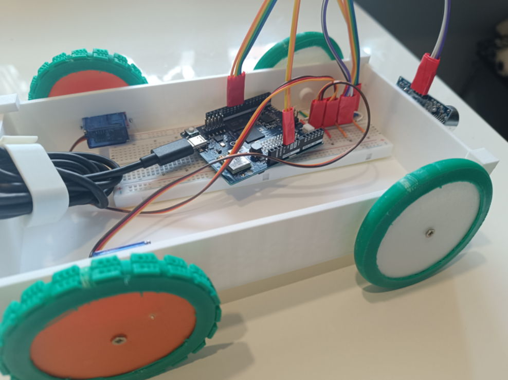
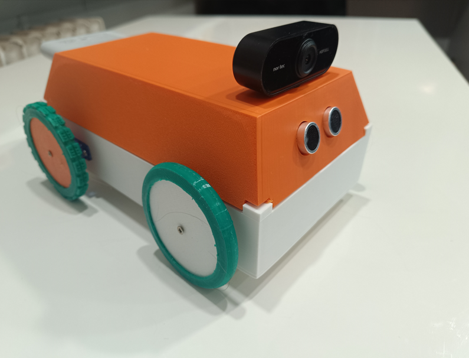
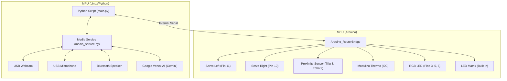
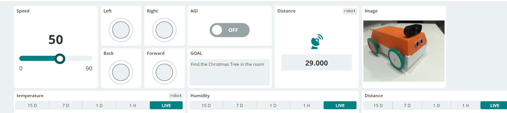
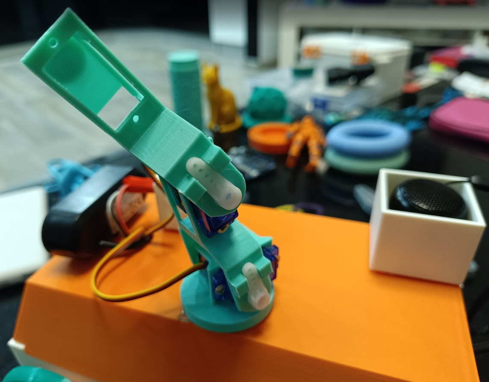

# AGI Robot

This project creates a **fully autonomous, LLM-powered mobile robot** that uses **Google Gemini 3 Flash (Preview)** for real-time decision-making, navigation, and human interaction. The robot combines computer vision, distance sensing, and multi-modal AI to explore environments, accomplish goals, and engage in natural conversations.



## Key Features

- 🤖 **Autonomous Navigation**: LLM-driven pathfinding with obstacle avoidance and spatial mapping
- 👁️ **Computer Vision**: Real-time image analysis for object detection and scene understanding
- 🎤 **Voice Interaction**: Dynamically records user responses (3-15s) based on noise levels, sends audio to LLM for context-aware replies
- 🗣️ **Multi-language TTS**: Supports English, Russian, Czech, Italian, and German with Google Chirp3/Chirp-HD voices
- 🌈 **Emotional Expression**: RGB LED "mood" changes based on robot's state (thinking, happy, cautious, etc.)
- 📊 **Cloud Integration**: Arduino Cloud for remote monitoring and control
- 🧠 **Memory & Planning**: Maintains movement history, spatial maps, and hierarchical plans with file-based persistence
- 🎵 **Sound Effects**: Plays contextual sounds to attract attention or express personality
- 🚨 **Safety Features**: Panic mode for emergency navigation and Telegram alarm notifications
- 📸 **Data Logging**: Automatic image capture to Google Drive for training datasets

## Current Specifications

-   **Core Hardware:** Arduino Uno Q (Microcontroller/Motor Control)
-   **Physical Dimensions:** 24cm wide, 12cm long, **10cm high**
-   **Movement:** Two wheels with 360-degree movement capability (differential drive) - **Pins 11 (Left) & 10 (Right)**. Note: Robot can move **ONLY on the floor**.
-   **Peripherals:** USB-C dongle (USB Camera with Mic, Bluetooth Speaker)
-   **Sensors:**
    -   Proximity/Distance Sensor (Trig Pin 8, Echo Pin 9)
    -   **Modulino Thermo** (Temperature & Humidity) - Connected via I2C/Qwiic
    -   RGB LED for mood expression
-   **Power:** PowerBank 10000 mAh
-   **Software Stack:** Python 3.12+, Google Cloud Vertex AI (Gemini 3 Flash Preview / Gemini 3 Pro Preview), Arduino Cloud, Pydantic (Structured Outputs)
-   **Connectivity:** WiFi required for API access

**Functionality:** The robot operates autonomously using an AGI loop: captures images, measures distance, consults the LLM, speaks responses, records user audio, and executes movement commands. All decisions are made by the AI model based on visual input, sensor data, goals, and conversation context.

## Project Cost

Below is a table listing all main components, their approximate cost (in USD, based on AliExpress prices), and the total amount.

| Component | Description | Cost (USD) |
| :-------- | :---------- | ---------: |
| **Arduino Uno Q** | Main microcontroller of the project | $44 |
| **2 x SG90 9g Servos** | Motors for wheels (360°) | $4 |
| **2 x SG90 9g Servos** | Motors for manipulator arm (180°) | $4 |
| **Webcam** | Cheap Chinese USB webcam (for visual input) | $3 |
| **USB Dongle (Adapter)** | For connecting webcam and PD | $3 |
| **Ultrasonic Sensor** | For distance measurement (e.g., HC-SR04) | $1.5 |
| **Bluetooth Speaker** | For audio output or feedback | $2.5 |
| **Solderless Breadboard and Wires** | For prototyping and component connections | $5 |
| **3D Printing Plastic** | About 200 grams (for case, mounts, etc., at ~$15/kg) | $3 |
| **Xiaomi Powerbank** | 10000 mAh (for power) | $10 |
| **3D Printer** | Gift, not counted | $0 |
| **Total Project Cost** | | **$80** |

As shown in the table, the total project cost is a very affordable **$80 USD**. This clearly demonstrates that implementing interesting and functional DIY solutions doesn't always require significant investments.

**Arduino Board:** The main portion of the budget goes to the controller. Choosing more budget-friendly boards (e.g., ESP32 or ESP8266, if functionality allows) could further reduce this expense.

**Peripherals:** The webcam, dongle, sensor, and speaker are typical representatives of inexpensive yet fully functional modules widely available on the market.

**Consumables:** The cost of 3D printing plastic and basic prototyping elements (breadboard, wires) is also minimal.

### LLM API Running Cost

The robot's consciousness operates in an autonomous loop, which incurs API costs for the LLM (Gemini):
- **Loop Duration**: ~20 seconds per consciousness loop
- **Cost per Loop**: $0.005
- **Cost per Hour**: $1 (continuous operation)

---

## Design Ideas and Future Considerations

### 1. Hardware Enhancements and Modularity

| Area                   | Current Status                           | Proposed Enhancement                                               | Rationale                                                                                        |
| :--------------------- | :--------------------------------------- | :----------------------------------------------------------------- | :----------------------------------------------------------------------------------------------- |
| **Microcontroller**    | Arduino Uno Q                            |                                                                    |                                                                                                  |
| **Motor Control**      | Integrated with Uno Q                    | Dedicated Motor Driver Shield (e.g., L298N or specialized drivers) | Better current handling, precision control, and separation of logic/power circuits.              |
| **Sensing/Navigation** | USB Camera + Proximity + Modulino Thermo | Integrate IMU (Accelerometer/Gyroscope)                            | Enable robust spatial awareness, obstacle avoidance, and precise movement/pose tracking.         |
| **Physical Structure** | Custom 3D Printed Chassis                |                                                                    | Modular housing for components, better stability, and improved aesthetics for component housing. |
| **Power Management**   | Single PowerBank                         |                                                                    | Ensure stable power for SBC, motors, and peripherals; implement low-power warning system.        |



### 2. Software Architecture and Code Structure

-   **Python Logic (`main.py`):**
    -   **AGI Loop**: Implements an autonomous loop (`agi_loop`) where the robot captures an image, checks distance, records audio responses, and consults the Gemini 3 Flash (Preview) model via `media_service.py` to decide on actions.
    -   **Audio Recording**: After the robot speaks, it records user audio with **dynamic duration** (3 to 15 seconds). It monitors noise levels (dB) to extend recording if the user is speaking, and stops early on silence. During recording, the RGB LED displays a **rainbow effect**.
    -   **Object Detection**: Uses `VideoObjectDetection` to identify objects in real-time and announce them (`send_detections_to_ui`).
    -   **Arduino Cloud**: Synchronizes state variables (`speed`, `agi`, `goal`, `lang`, `rgb`) and telemetry (`distance`, `temperature`, `humidity`).
    -   **RGB Mood**: Converts HSV color values from Arduino Cloud to RGB for the robot's "mood" LED.
    -   **Movement History**: Tracks all movement commands to prevent loops and aid navigation.
    
-   **Media Service (`media_service.py`):**
    -   **HTTP Server** (Port 5000) with the following endpoints:
        -   **GET `/play`**: Plays audio files via `aplay` (parameter: `filename`)
        -   **GET `/play_random`**: Plays a random sound from the `sounds` directory
        -   **GET `/speak`**: Text-to-Speech using Google Cloud TTS (parameters: `text`, `lang`)
            - Supports multiple languages:
              - English: `en-US-Chirp3-HD-Zubenelgenubi`
              - Russian: `ru-RU-Wavenet-D`
              - Czech: `cs-CZ-Chirp3-HD-Enceladus`
              - Italian: `it-IT-Chirp-HD-D`
              - German: `de-DE-Chirp-HD-D`
            - Implements caching to avoid re-synthesizing the same text
            - Audio output: LINEAR16 with +10dB volume gain for clarity
        -   **GET `/telegram`**: Sends alarm messages to admin via Telegram Bot (parameter: `message`)
            - Requires `TELEGRAM_KEY` and `ADMIN_ID` environment variables
        -   **POST `/llm_vision`**: Sends image, distance, plan, subplan, map, movement history, **and audio** to Gemini LLM
            - Parameters: `asi` (bool) - to select model:
                - `false` (default): **Gemini 3 Flash Preview** (Fast, low latency)
                - `true`: **Gemini 3 Pro Preview** (High reasoning, slower)
            - Returns JSON with: `speak`, `sound`, `move`, `rgb`, `plan`, `subplan`, `map`, `memory`, `alarm`
            - Receives images via Socket.IO from the webcam service (default: `http://localhost:4912`)
            - **Image Logging**: Saves all incoming images to `/home/arduino/google-drive/robot` with timestamps for debugging/dataset creation
            - Includes sophisticated prompt engineering for robot behavior and safety rules
            - **Reasoning**: Uses a thinking budget (16k tokens) for complex chain-of-thought processing
            - **Alarm System**: Automatically sends Telegram notifications when LLM detects critical/dangerous conditions

-   **Arduino MCU (`sketch.ino`):**
    -   **Libraries Used**: `Arduino_RouterBridge`, `Modulino`, `Servo`, `NewPing`
    -   **Main Loop Operations**:
        1. Reads ultrasonic distance sensor (NewPing library) every 1 second
        2. Reads temperature and humidity from Modulino Thermo (I2C)
        3. Updates Arduino Cloud telemetry via Bridge notifications (`set_distance`, `set_temperature`, `set_humidity`)
    -   **Python Control Loop** (`main.py`):
        - Executes movement commands based on cloud variables (`speed`, `back`, `left`, `right`, `forward`, `panic`, `agi`)
        - Priority order: Manual controls → Panic mode → AGI mode → Stop
    -   **Manual Control**: Individual direction booleans (`back`, `left`, `right`, `forward`) with configurable speed
    -   **Panic Mode**: Emergency navigation mode - moves forward if clear (>25cm), otherwise backs up, plays random sound, and rotates
    -   **AGI Mode**: Calls `agi_loop()` function in Python, receives LLM decisions, executes complex multi-step commands
    -   **RGB Parsing**: Converts "R,G,B" string to individual values, applies hardware color correction (Red÷1.2, Green÷2, Blue×1)
    -   **Movement Calibration**:
        - Linear: ~20 cm/sec at speed 45
        - Rotation: ~40 ms/degree (empirical)
        - Safety: Stops forward movement if distance < 10cm
    -   **Bridge Functions Exposed**: `getDistance()`, `setRGB(string)`, `move(string, bool)`, `panic(int)`


# Robot Hardware Schema

## Overview

The Uno Q consists of an MCU handling motor control and an MPU (Linux Environment) handling high-level logic, vision, and audio.

## Connection Diagram


```mermaid
graph TD
    subgraph MPU ["MPU (Linux/Python)"]
        Python["Python Script (main.py)"]
        MediaService["Media Service (media_service.py)"]
        Webcam["USB Webcam"]
        Mic["USB Microphone"]
        Speaker["Bluetooth Speaker"]

        Python <--> MediaService
        MediaService <--> Webcam
        MediaService <--> Mic
        MediaService <--> Speaker
        MediaService <--> VertexAI["Google Vertex AI (Gemini)"]
    end

    subgraph MCU ["MCU (Arduino)"]
        Bridge["Arduino_RouterBridge"]
        ServoL["Servo Left (Pin 11)"]
        ServoR["Servo Right (Pin 10)"]
        Sensor["Proximity Sensor (Trig 8, Echo 9)"]
        Modulino["Modulino Thermo (I2C)"]
        RGB["RGB LED (Pins 3, 5, 6)"]

        Bridge --> ServoL
        Bridge --> ServoR
        Bridge --> Sensor
        Bridge --> Modulino
        Bridge --> Matrix["LED Matrix (Built-in)"]
        Bridge --> RGB
    end

    Python <-->|Internal Serial| Bridge
```

## Pinout Configuration

| Component       | Arduino Pin | Description                       |
| :-------------- | :---------- | :-------------------------------- |
| **Servo Left**  | D11         | Left Wheel (Continuous Rotation)  |
| **Servo Right** | D10         | Right Wheel (Continuous Rotation) |
| **Sensor**      | D8, D9      | Proximity/Distance (Trig/Echo)    |
| **Modulino**    | I2C         | Temperature & Humidity Sensor     |
| **Matrix**      | Built-in    | 12x8 LED Matrix                   |
| **RGB LED**     | D6, D2, D1  | Red, Green, Blue (Common Cathode) |
| **Arm Servo 1** | D3          | Manipulator Arm Base (0-180°)     |
| **Arm Servo 2** | D5          | Manipulator Arm Joint (0-180°)    |
| **USB**         | USB Port    | Serial Communication/Webcam       |

## Arduino Cloud Variables

The following variables are synchronized with the Arduino Cloud:

-   **Read/Write (Controls):**

    -   `agi` (bool): Master switch to enable/disable the autonomous AGI loop.
    -   `asi` (bool): Toggle to use **Gemini 3 Pro Preview** (Smarter) instead of Flash Preview (Faster).
    -   `goal` (str): Current main goal for the robot (retrieved from cloud).
    -   `speed` (int): Controls the speed of the robot (0-90, where 45 is baseline).
    -   `back` (bool): Command to move backward.
    -   `left` (bool): Command to turn left.
    -   `right` (bool): Command to turn right.
    -   `forward` (bool): Command to move forward.
    -   `rgb` (CloudColoredLight): RGB LED control with HSV values:
        -   `rgb:hue` (0-360): Hue value
        -   `rgb:sat` (0-100): Saturation percentage
        -   `rgb:bri` (0-100): Brightness percentage
        -   `rgb:swi` (bool): Switch on/off
        -   The Python code converts HSV to RGB string format (e.g., "255,128,0") and sends to MCU
    -   `lang` (str): Language code for TTS (en, ru, cz/cs, it, de) or "disabled" for silent mode.
    -   `panic` (bool): Emergency navigation mode toggle.
    -   `arm1` (int): Control angle for Arm Servo 1 (0-180).
    -   `arm2` (int): Control angle for Arm Servo 2 (0-180).

-   **Read-Only (Telemetry):**
    -   `distance` (int): Distance measured by the ultrasonic sensor (cm).
    -   `temperature` (float): Temperature from Modulino sensor (Celsius).
    -   `humidity` (float): Humidity from Modulino sensor (%).
    -   `plan` (str): Current global strategy/reasoning from LLM.
    -   `subplan` (str): Current tactical action description.
    -   `space_map` (str): Text-based 2D spatial map.
    -   `movement_history` (str): JSON array of past movement commands.
    -   `memory` (str): Persistent facts/knowledge learned by the robot.
    -   `alarm` (str): Current alarm status/message (empty = no alarm).




## Power Distribution

-   **Arduino**: Powered via USB PowerBank


## MPU Requirements

-   **OS**: Linux Debian 13
-   **Python**: 3.12+
-   **Ports**: 1x USB-C host for Arduino, 1x USB-A for Webcam with mic.
-   **Dependencies**: 
    -   `arduino-app-utils` (Arduino Cloud SDK)
    -   `google-genai` (Gemini API)
    -   `google-api-python-client` (Google TTS)
    -   `python-socketio[client]` (Image streaming)
    -   `aplay` (Audio playback utility)

## Setting Up Autostart on Debian

To automatically start `media_service.py` on boot in Debian, the repository includes systemd service configuration files in the `etc/` folder.

### Installation Steps

1. **Copy the rc.local script** to `/etc/`:
   ```bash
   sudo cp etc/rc.local /etc/rc.local
   sudo chmod +x /etc/rc.local
   ```

2. **Edit `/etc/rc.local`** to update paths and credentials:
   ```bash
   sudo nano /etc/rc.local
   ```
   
   Update the following variables:
   - `GEMINI_KEY`: Your Google Gemini API key
   - Bluetooth MAC address (if using different speaker)
   - Paths to match your installation directory

3. **Copy the systemd service** file:
   ```bash
   sudo cp etc/rc-local.service /etc/systemd/system/rc-local.service
   ```

4. **Enable and start the service**:
   ```bash
   sudo systemctl daemon-reload
   sudo systemctl enable rc-local.service
   sudo systemctl start rc-local.service
   ```

5. **Check service status**:
   ```bash
   sudo systemctl status rc-local.service
   ```

### What the Script Does

The `rc.local` script performs the following on boot:
- Waits 20 seconds for system initialization
- Sets the `GEMINI_KEY` environment variable
- Connects to the Bluetooth speaker (via `bluetoothctl`)
- Creates required runtime directories for PulseAudio (`/run/user/1000/pulse`)
- Plays a startup sound to confirm audio is working
- Starts `media_service.py` from the Python directory

### Troubleshooting

- **Check logs**: `journalctl -u rc-local.service -f`
- **Manual test**: Run `/etc/rc.local start` as the arduino user
- **Bluetooth issues**: Verify speaker MAC address with `bluetoothctl devices`
- **Audio issues**: Test with `aplay -l` to confirm sound card detection

---

## Configuration

### Environment Variables

The system requires the following environment variables:

-   **`GOOGLE_APPLICATION_CREDENTIALS`**: Path to Google Cloud service account JSON file
    - Linux: `/home/arduino/google.json`
    - Windows: `C:\My-progs\Python\agi-robot\google.json`
-   **`GEMINI_KEY`**: Google Gemini API key for LLM access
-   **`IMAGE_SERVER_URL`** (optional): Socket.IO server URL for webcam feed (default: `http://localhost:4912`, coming from video detection brick)
-   **`TELEGRAM_KEY`** (optional): Telegram Bot API token for alarm notifications
-   **`ADMIN_ID`** (optional): Telegram chat ID for receiving robot alarms

### File Structure

```
agi-robot/
├── python/
│   ├── main.py              # Main robot control logic
│   ├── media_service.py     # HTTP server for TTS, LLM, and audio
│   ├── sounds/              # Directory for random sound effects (.wav files)
│   ├── memory.txt           # Persistent memory storage (auto-created)
│   └── mic.wav              # Temporary audio recording (auto-deleted after use)
├── sketch/
│   └── sketch.ino           # Arduino MCU firmware
└── google.json              # Google Cloud credentials
```

### Startup Behavior

On initialization, the robot:
1. Connects to Arduino Cloud and synchronizes variables
2. Initializes the webcam object detection stream
3. **RGB Rainbow**: Performs a color cycle sequence on the LED to indicate hardware readiness
4. Plays a startup sound
5. Speaks "Robot is ready" in the configured language
6. Sets default goal: **"Be helpful assistant to the master human"**
7. Begins listening for cloud variable changes (AGI mode, manual controls, goal updates)

### Default Main Goal

The robot's default goal is **"Be helpful assistant to the master human"**, but this can be changed via the Arduino Cloud `goal` variable. When a new goal is set from the cloud, the robot will speak the new goal and update its behavior accordingly.

---

## AGI Loop Behavior

The AGI Loop is the core autonomous decision-making cycle of the robot. It operates as follows:

### Input Processing

1. **Visual Input**: Captures live image from webcam via Socket.IO connection
2. **Distance Sensing**: Reads ultrasonic sensor data (0-1000 cm)
3. **Context State**: Maintains `plan`, `subplan`, `space_map`, and `movement_history`
4. **Audio Input**: After speaking, dynamically records (3-15s) to capture user responses
5. **Main Goal**: Retrieved from Arduino Cloud `goal` variable

### LLM Decision-Making

The robot sends all inputs to **Gemini LLM** (Flash or Pro based on `asi` setting) with a sophisticated prompt that includes:

-   **Safety Rules**: Must stop or turn if distance < 25cm to avoid collisions (Hardware failsafe stops motors at <10cm)
-   **Navigation Strategy**: Systematic scanning by turning 30-60 degrees, approaching targets
-   **Social Behavior**: Use casual sounds to attract human attention
-   **Memory Management**: Use history to avoid loops and repeated actions
-   **Planning Hierarchy**: Global `plan` for overall strategy, `subplan` for immediate steps
-   **Spatial Mapping**: Maintain and update a text-based 2D map (1x1 meter blocks)
-   **Mood Expression**: RGB LED color reflects robot's emotional state

### LLM Response Format

The model returns a structured JSON object validated by Pydantic schemas:

```json
{
  "speak": {"text": "What I want to say"},
  "sound": "casual",
  "moves": [
    {"command": "forward|back|left|right|stop", "distance_cm": 20-300, "angle_deg": 10-180}
  ],
  "rgb": "R,G,B",
  "arm1": 0-180,
  "arm2": 0-180,
  "plan": "Global strategy description",
  "subplan": "Immediate next steps",
  "space_map": "Text-based spatial map with legend",
  "memory": "Updated persistent knowledge",
  "alarm": "Critical condition description (or empty string)"
}
```

### Action Execution

1. **Speech**: Uses Google TTS with language-specific Chirp/WaveNet voices (en/ru/cz/it/de)
2. **Audio Recording**: Captures 3-15 seconds of audio (dynamic extension) while cycling RGB colors (Rainbow) to indicate listening state.
3. **Sound Effects**: Plays random sound from `sounds/` directory to attract attention
4. **RGB Mood**: Updates LED color based on robot's emotional state:
   - White (255,255,255): Neutral/Ready
   - Green (0,255,0): Happy/Success
   - Red (255,0,0): Blocked/Frustrated
   - Blue (0,0,255): Thinking/Processing
   - Yellow (255,255,0): Curious/Searching
   - Orange (255,165,0): Cautious/Obstacle Nearby
   - Purple (128,0,128): Excited/Special Discovery
5. **Movement**: Sends command string to MCU via Bridge notification
6. **Memory**: Saves updated memory to `memory.txt` for persistence across sessions
7. **Alarm**: If alarm is non-empty, sends Telegram notification to admin
8. **Cloud Sync**: Updates all state variables to Arduino Cloud for remote monitoring

## MCU Command Protocol

The MCU executes movement commands received from the AGI loop via the `agi_loop()` bridge function.

### Command Format

Commands are formatted as pipe-delimited strings:

**MOVE Command:**
```
MOVE|direction|distance_cm|speed
```
- `direction`: `forward` or `back`
- `distance_cm`: Distance to travel (integer)
- `speed`: Motor speed 0-90 (45 is baseline)

**TURN Command:**
```
TURN|direction|angle_deg|speed
```
- `direction`: `left` or `right`
- `angle_deg`: Rotation angle (integer)
- `speed`: Motor speed 0-90

**STOP Command:**
```
STOP
```

### Movement Calibration

The MCU uses empirical calibration values:
- **Linear Movement**: ~20 cm/sec at speed 45
- **Rotation**: ~30 ms/degree at speed 45
- Speed scaling: `actual_speed = base_speed * (requested_speed / 45.0)`

### RGB LED Processing

The MCU receives RGB values as a comma-separated string (e.g., "255,128,0") and applies color correction:
- Red: `value / 1.2`
- Green: `value / 2`
- Blue: `value` (no correction)

---


### Completed Features ✓
- [x] RGB LED control with HSV from Arduino Cloud
- [x] Multi-language TTS (English, Russian, Czech, Italian, German)
- [x] All languages support for input
- [x] Audio recording after speech for user responses
- [x] Movement history tracking
- [x] Spatial mapping hints to LLM
- [x] RGB mood expression based on robot state
- [x] Proximity sensor integration
- [x] Arduino Cloud variable synchronization
- [x] Google grounding for real-time web search
- [x] Persistent conversation memory across sessions (file-based)
- [x] Panic mode for emergency navigation
- [x] Telegram alarm notifications
- [x] Image logging to Google Drive
- [x] Temperature and humidity monitoring
- [x] Structured Outputs (Pydantic) for type-safe LLM responses
- [x] Manipulator arm with 2 SG90 180° servos on the roof for object interaction 
- [x] Migrate from Arduino Cloud to own backend+site (https://robot.mvpgen.com)

## TODO

- [ ] Daily blog post (diary of robot) from consciousness logs in Sartre style using GEMINI_KEY env on server (only if >10 logs for today, check 10pm)
- [ ] IMU + magnetometer integration for better orientation tracking


