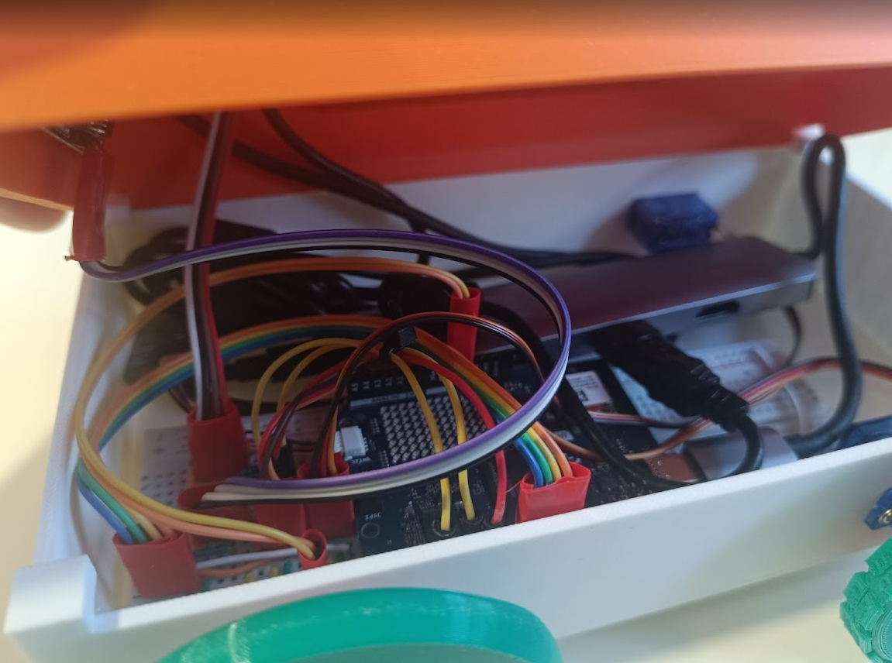
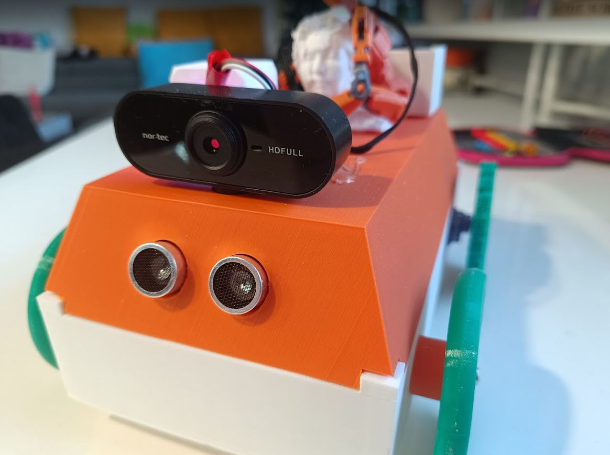

# AGI Robot Assembly Guide

Welcome to the assembly guide for the **AGI Robot**—a fully autonomous, LLM-powered mobile explorer. This guide will walk you through 3D printing the chassis, assembling the mechanical components, and wiring the electronics.

---

## 🛠️ Bill of Materials (BOM)

| Category | Item | Quantity | Approx. Cost |
| :--- | :--- | :---: | :--- |
| **Microcontroller** | Arduino Uno R4 WiFi (Arduino Uno Q) | 1 | $44 |
| **Actuators** | SG90 360° Continuous Rotation Servos (Wheels) | 2 | $4 |
| **Actuators** | SG90 180° Standard Servos (Manipulator Arm) | 2 | $4 |
| **Vision** | USB Webcam with Microphone | 1 | $3 |
| **Audio** | Bluetooth Speaker / USB Speaker | 1 | $2.5 |
| **Sensors** | HC-SR04 Ultrasonic Distance Sensor | 1 | $1.5 |
| **Sensors** | Modulino Thermo (I2C) | 1 | - |
| **Lighting** | RGB LED (Common Cathode) | 1 | - |
| **Power** | 10000 mAh PowerBank | 1 | $10 |
| **Connectivity** | USB-C to USB-A Hub (Dongle) | 1 | $3 |
| **Prototyping** | Breadboard & Jumper Wires | - | $5 |
| **Structure** | 3D Printed Parts (PLA/PETG) | ~200g | $3 |

---

## 🖨️ 3D Printing

All models are located in the [/3d](file:///c:/My-progs/Python/agi-robot/3d) folder.

### Core Components
- **[Chassis.stl](file:///c:/My-progs/Python/agi-robot/3d/Chassis.stl)**: The main body that holds the breadboard and Arduino.
- **[Cabin.stl](file:///c:/My-progs/Python/agi-robot/3d/Cabin.stl)**: The top cover (roof) where the camera and arm are mounted.
- **[Arduino_Base.stl](file:///c:/My-progs/Python/agi-robot/3d/Arduino_Base.stl)**: Mount for the Arduino Uno.

### Drive System
- **[Parametric_wheel.stl](file:///c:/My-progs/Python/agi-robot/3d/Parametric_wheel.stl)**: Two required for the front drive.
- **[Tire.stl](file:///c:/My-progs/Python/agi-robot/3d/Tire.stl)**: Flexible tires for the wheels.
- **[Rear_wheel.stl](file:///c:/My-progs/Python/agi-robot/3d/Rear_wheel.stl)**: Small trailing wheel for stability.

### Manipulator & Mounts
- **[Arm1.stl](file:///c:/My-progs/Python/agi-robot/3d/Arm1.stl)** & **[Arm2.stl](file:///c:/My-progs/Python/agi-robot/3d/Arm2.stl)**: The two segments of the robot arm.
- **[Servo_Mount.stl](file:///c:/My-progs/Python/agi-robot/3d/Servo_Mount.stl)**: Support for the arm servos.
- **[Webcam_mount.stl](file:///c:/My-progs/Python/agi-robot/3d/Webcam_mount.stl)**: Tilting mount for the camera.

---

## 🔧 Mechanical Assembly

### 1. The Chassis
1. **Mount the Servos**: Insert the two 360° SG90 servos into the slots on the side of the [Chassis.stl](file:///c:/My-progs/Python/agi-robot/3d/Chassis.stl).
2. **Arduino & Breadboard**: Place the [Arduino_Base.stl](file:///c:/My-progs/Python/agi-robot/3d/Arduino_Base.stl) inside the chassis. Slot the breadboard next to it.
3. **Wheels**: Press-fit the [Parametric_wheel.stl](file:///c:/My-progs/Python/agi-robot/3d/Parametric_wheel.stl) onto the servo shafts. Add the [Tire.stl](file:///c:/My-progs/Python/agi-robot/3d/Tire.stl) for traction.

### 2. The Head & Cabin
1. **Ultrasonic Sensor**: Snap the HC-SR04 into the two circular holes at the front of the [Cabin.stl](file:///c:/My-progs/Python/agi-robot/3d/Cabin.stl).
2. **Webcam**: Use the [Webcam_mount.stl](file:///c:/My-progs/Python/agi-robot/3d/Webcam_mount.stl) to attach the camera to the roof.
3. **Manipulator Arm**: Assemble [Arm1.stl](file:///c:/My-progs/Python/agi-robot/3d/Arm1.stl) and [Arm2.stl](file:///c:/My-progs/Python/agi-robot/3d/Arm2.stl) using the 180° servos and mount them on top of the cabin.

---

## ⚡ Electronics & Wiring

The heart of the robot is the Arduino Uno R4 WiFi. Connect the components according to the table below:

| Component | Arduino Pin | Wire Color (Typical) |
| :--- | :---: | :--- |
| **Left Wheel Servo** | **D11** | Signal (Orange/White) |
| **Right Wheel Servo** | **D10** | Signal (Orange/White) |
| **Arm Servo 1 (Base)** | **D3** | Signal (Orange/White) |
| **Arm Servo 2 (Joint)** | **D5** | Signal (Orange/White) |
| **Ultrasonic Trig** | **D8** | Trigger |
| **Ultrasonic Echo** | **D9** | Echo |
| **RGB LED (Red)** | **D4** | Red Leg |
| **RGB LED (Green)** | **D6** | Green Leg |
| **RGB LED (Blue)** | **D2** | Blue Leg |
| **Modulino Thermo** | **I2C** | Qwiic Connector |

> [!IMPORTANT]
> **Power Connection**: All servos and the Arduino should share a common ground (GND). Ensure your PowerBank can provide at least 2A of current to prevent brownouts during movement.

---

## 🚀 Software Setup

### 1. Arduino Firmware
- Connect the Arduino Uno Q to your PC.
- ssh or adb to board
- cd ~/ArduinoApps
- git pull https://github.com/mvpgen/agi-robot.git
- Start AppLab and navigate to the agi-robot application
- Click "Run" and "Set up as default"

### 2. Python Environment (MPU)
- Ensure you have Python 3.12+ installed on the robot's Linux environment.
- Install dependencies:
  ```bash
  pip install arduino-app-utils google-genai google-api-python-client python-socketio[client]
  ```
- Set your `GEMINI_KEY` and path to `google.json`.

### 3. Running the Robot
- Start the media service: `python python/media_service.py`
- Start the main control loop: `python python/main.py`
- Open the dashboard at [robot.mvpgen.com](https://robot.mvpgen.com) to take control!

---


*Interior view showing breadboard, Arduino, and USB hub placement.*


*The fully assembled robot with cabin and sensors.*
